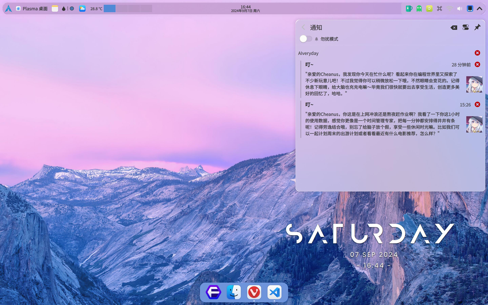

# AIveryday
让**LLMs**读懂你的**桌面活动**，时不时发个有趣的**桌面消息**！

Let **LLMs** understand your **desktop activities** and send you interesting **desktop messages** from time to time!



## 项目简介
AIveryday是一个基于LLMs的项目，它可以让LLMs读懂你的桌面活动，时不时发个有趣的桌面消息，让你的电脑体验变得更有趣。

本项目的主要特点有：
- **个性化**：AIveryday可以调用开源项目[ActivityWatch](https://github.com/ActivityWatch/activitywatch)所收集的数据，获取你的**浏览应用、窗口标题和活动类别**等信息，读懂你的桌面活动，然后给你发送有趣的通知。
- **性格定制**：AIveryday的性格可以通过prompt定制，你可以自由选择AIveryday的性格和角色，比如选择一个可爱的小猫咪，或者选择一位幽默的**虚拟女友**作为AIveryday的形象。
- **消息推送**：AIveryday可以通过**桌面通知**的方式向你推送消息，时间间隔随机，就像你真实的朋友一样，给你发消息或者分享一些有趣的事情。
- **多平台支持**：AIveryday支持**Windows**、**MacOS**和**Linux**等多个平台，你可以在不同的操作系统上使用AIveryday。
- **隐私保护**：AIveryday不会收集你的任何隐私数据，所有的数据都可以在本地进行处理的。同时，在本地内存不足时，也能自动调用远程LLMs处理。
- **LLMs支持**：AIveryday是基于LLMs的项目，你可以使用任何一款支持openAI格式的LLMs来运行AIveryday。

## 快速开始
### 安装
```bash
pip install requests pyyaml pytz psutil openai
```
对于Windows/MacOS用户，还需要安装`plyer`库：
```bash
pip install plyer
```
对于显卡推理用户，确保能够使用`nvidia-smi`命令。

另外，你还需要安装ActivityWatch，具体安装方法请参考[ActivityWatch](https://github.com/ActivityWatch/activitywatch)。注意以下几点：
- 如果你是Linux Wayland用户，需要使用[awatcher](https://github.com/2e3s/awatcher)
- 尽可能完善你的ActivityWatch设置，特别是**类别规则**的设置
- 请尽可能确保ActivityWatch的类别和你所使用的LLMs的**语言**一致，以便AIveryday能够更好地读懂你的桌面活动

### 配置
创建属于自己的`config.yaml`文件：
```bash
cp example.config.yaml config.yaml
```
然后参照注释填写`config.yaml`文件中的必要信息：

- 首先填写`openai`，包括`api_key`和`model`等信息。`min_memory`是使用本地LLMs的内存占用阈值，当检测到本地内存不足时，会调用远程LLMs处理。此外，这里还有几种常见的配置方式：
    1. 如果你只想使用远程LLMs，可以将`min_memory`设置为很大的值，比如`1.e+12`。
    2. 如果你只想使用本地LLMs，可以将`min_memory`设置为很小的值，比如`0`。
    3. 如果你只想使用本地LLMs，但是在本地内存不足时，也不想调用远程LLMs，只是跳过这次处理，可以将`remote-base_url`设置为`None`。

- 然后填写`ActivityWatch`，特别注意bucket的名称，确保与你所使用的ActivityWatch中的名称一致。

- 之后设定你专属的`prompts`，发挥你的想象力，定制AIveryday的性格和角色。目前支持以下数据的引用：
    - `scope_hour`：该prompt所查询的过去事件的时间范围，单位为小时
    - `duration_min`：在`scope_hour`时间范围内，你在线的时间，单位为分钟
    - `datetime`：当前日期时间
    - `top_app`：你最常用的几个应用名称，由ActivityWatch提供
    - `top_title`：你最常浏览的几个窗口标题，由ActivityWatch提供
    - `top_cat`：你最常活动的类别，由ActivityWatch提供

- 最后填写`notify`，其中`platform`是你所使用的操作系统，支持`windows`、`macos`和`linux`。并注意设置`icon_path`为你想使用的通知图标路径。

其他配置项可以根据自己的需求进行调整。

### 运行
在确保ActivityWatch服务正常运行的情况下，运行`startAD.py`，AIveryday将会每隔一段时间运行1次：
```bash
python startAD.py
```
或者，你也可以暂时先尝试1次AIveryday的运行效果：
```bash
python startAD.py --test
```
注：为了让弹窗消息消失后能够保存在通知历史中，某些Linux用户可能需要单独设置。例如KDE用户需要在`设置-通知-应用程序设置-其他应用`中勾选“在通知历史中显示”。

### 开机自启
**Linux**

linux用户可以将AIveryday添加到开机启动项中，具体操作如下：
1. 将`timer/AIveryday.service`拷贝到`~/.config/systemd/user/`目录下。
2. 运行`systemctl --user enable AIveryday.service`以开机自启AIveryday服务。
3. 运行`systemctl --user start AIveryday.service`以启动AIveryday服务。

**Windows**

对于Windows用户，可以将AIveryday添加到开机启动项中，具体操作如下：
1. 按下`Win + R`，输入`shell:start`，打开启动文件夹。
2. 将`timer/AIveryday.bat`拷贝到启动文件夹中。
3. 重启电脑，AIveryday将会自动启动。

**MacOS**

MacOS用户可以将AIveryday添加到开机启动项中，具体操作如下：
1. 打开`系统偏好设置`，选择`用户与群组`。
2. 选择`登录项`，点击`+`，选择`AIveryday.app`。
3. 重启电脑，AIveryday将会自动启动。

## 计划
- [ ] 对通知中的消息继续聊天
- [ ] 保存通知记录
- [ ] 多种输出方式，如生成日记等

## 相关项目
- [ActivityWatch](https://github.com/ActivityWatch/activitywatch)